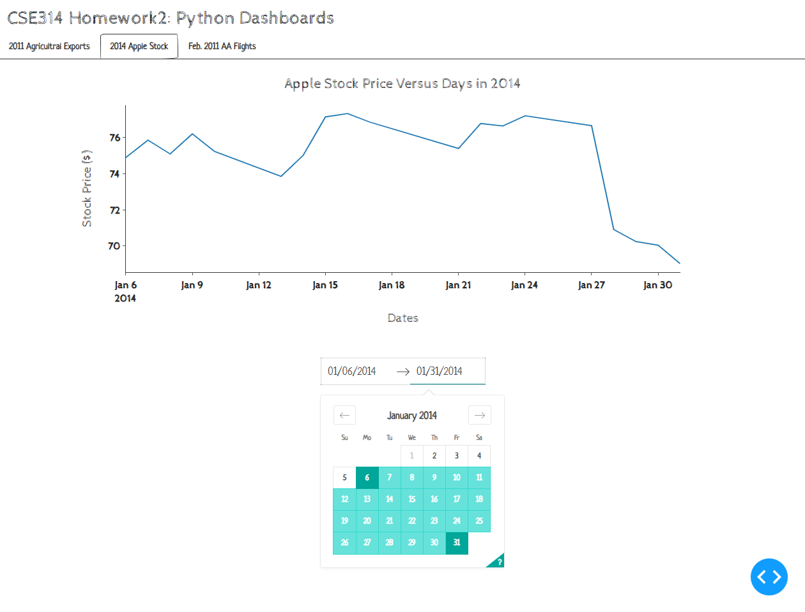
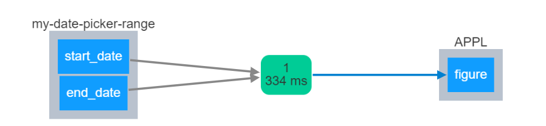

# Apple Stock Dataset (2014)

For full dataset view [plotly/datasets/2014_apple_stock.csv](https://github.com/plotly/datasets/blob/master/2014_apple_stock.csv).

## Overview

* ###Why the visualization is interesting? 
    - Users can easily choose the date range from a calendar.

## Demo

## Callbacks

`update_AAPL_fig(start_date,end_date)` - Update x-axis range of the APPL line graph according to the selected date range

**Parameters:** 
** - start_date: ** `date object` start date, will be converted to string in `YYYY-MM-DD` format 
** - end_date: ** `date object`  end date, will be converted to string in `YYYY-MM-DD` format 
** - returns: ** `figure` a line graph with updated date range that will be passed into the dcc.Graph component 

