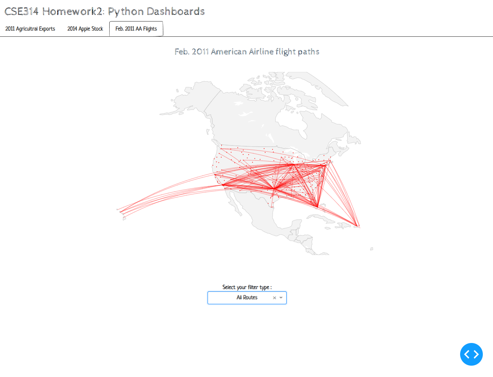
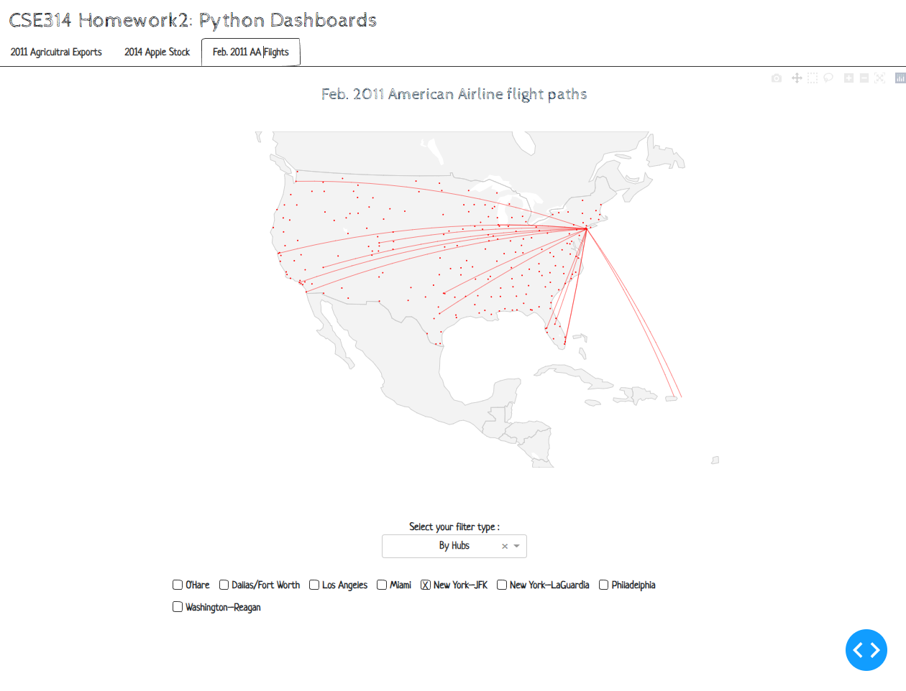
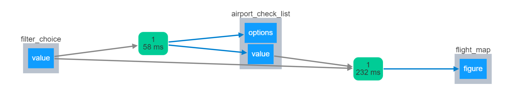

# American Airlines Flight Path Dataset (2011)

For full dataset view [2011_february_aa_flight_paths.csv](https://github.com/plotly/datasets/blob/master/2011_february_aa_flight_paths.csv) and 
[2011_february_us_airport_traffic.csv](https://github.com/plotly/datasets/blob/master/2011_february_us_airport_traffic.csv)

## Overview

* ###Why the visualization is interesting? 
    - Dataset is visualized on a map.
    - Users can choose filter types to view all flight paths, find flight paths by departure/arrival airports, or flight paths associated with AA hubs.  
    - This visualization includes a **chained callback**. Whenever a filter is selected, a checklist containing the filtered airports will appear for further selection.

## Demo

## Callbacks

`generate_checklist_from_filter(filter_choice):` - Generate a checklist of airports based on the filter type selection

**Parameters:** 
** - filter_choice: ** `str` a selected filter name from the dropdown list 
** - returns: **  
--`str` a list of airport codes that will be the `options` for the airport checklist 
--`str` a list of airport codes that will be the default 'value' for the for the airport checklist

`update_flight_map(filter_type, airport_choice):` - Update the flight path map based on the current selected filter type and airport checklist selections

**Parameters:** 
** - filter_type: ** `str` a selected filter name from the dropdown list 
** - airport_choice: ** `str` a list of selected airport codes from the airport checklist 
** - returns: ** `figure`  an updated flight path map that will be passed into the dcc.Graph component 

